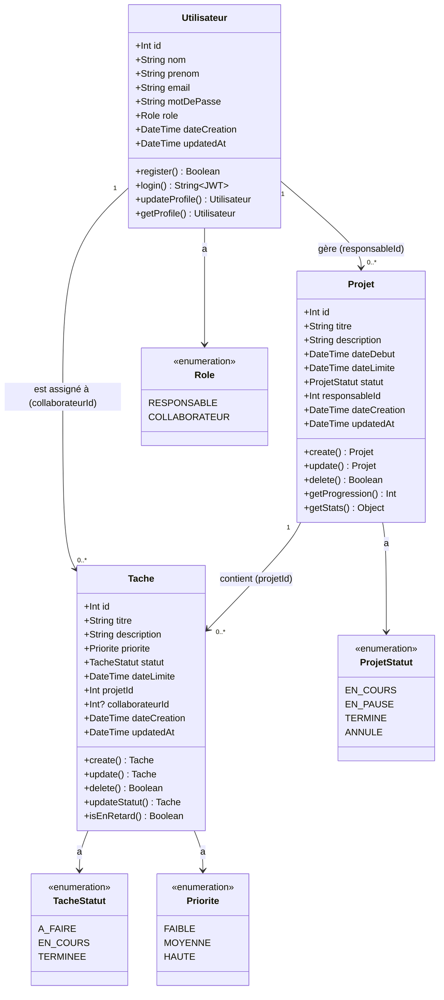
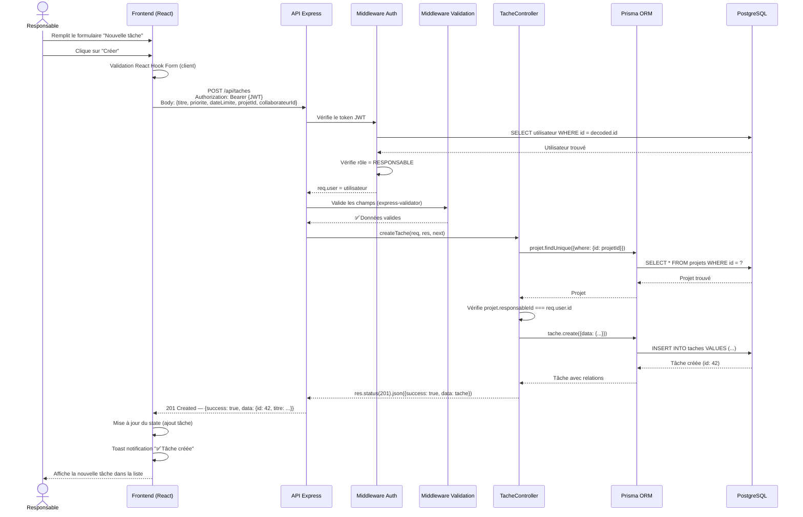
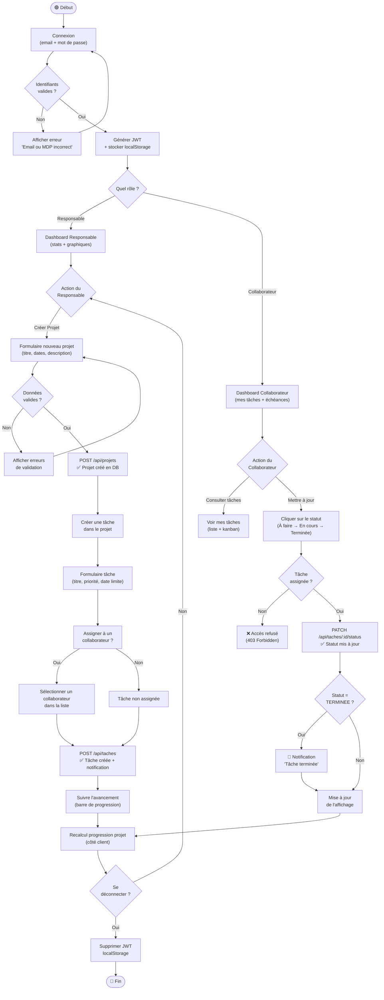
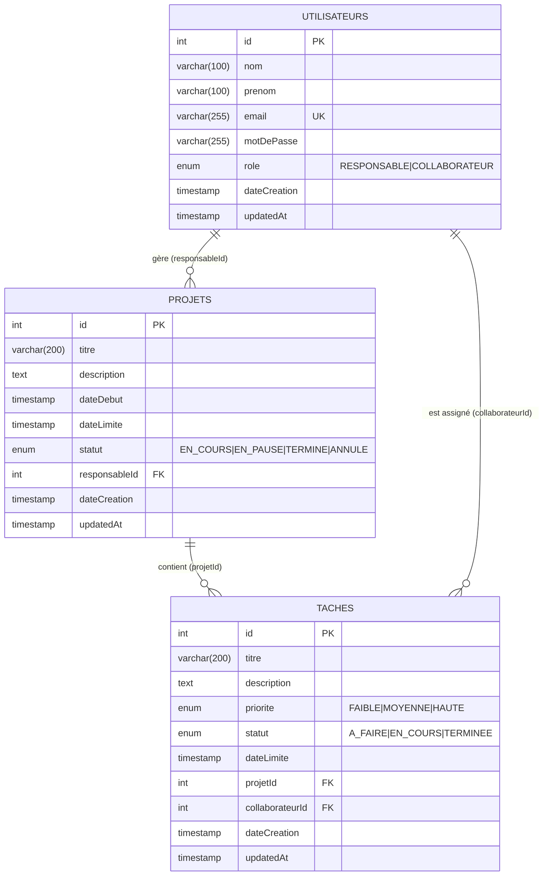

# Diagrammes UML — Suivi de Projets pour Micro-Entreprise

> Tous les diagrammes sont écrits en syntaxe **Mermaid** et peuvent être visualisés sur [mermaid.live](https://mermaid.live)

---

## 1. Diagramme de Cas d'Utilisation

```mermaid
graph TB
    subgraph Système["🖥️ Système : Suivi de Projets"]

        subgraph Auth["Authentification"]
            UC1["Se connecter"]
            UC2["S'inscrire"]
            UC3["Se déconnecter"]
            UC4["Modifier son profil"]
        end

        subgraph ProjMgmt["Gestion des Projets"]
            UC5["Créer un projet"]
            UC6["Modifier un projet"]
            UC7["Supprimer un projet"]
            UC8["Consulter un projet"]
        end

        subgraph TacheMgmt["Gestion des Tâches"]
            UC9["Créer une tâche"]
            UC10["Modifier une tâche"]
            UC11["Supprimer une tâche"]
            UC12["Attribuer une tâche"]
            UC13["Modifier le statut"]
            UC14["Consulter ses tâches"]
        end

        subgraph Dashboard["Tableau de Bord"]
            UC15["Consulter tableau de bord Responsable"]
            UC16["Consulter tableau de bord Collaborateur"]
            UC17["Voir graphiques d'avancement"]
        end

    end

    Responsable(("👑\nResponsable"))
    Collaborateur(("👤\nCollaborateur"))

    Responsable --- UC1
    Responsable --- UC2
    Responsable --- UC3
    Responsable --- UC4
    Responsable --- UC5
    Responsable --- UC6
    Responsable --- UC7
    Responsable --- UC8
    Responsable --- UC9
    Responsable --- UC10
    Responsable --- UC11
    Responsable --- UC12
    Responsable --- UC13
    Responsable --- UC15
    Responsable --- UC17

    Collaborateur --- UC1
    Collaborateur --- UC2
    Collaborateur --- UC3
    Collaborateur --- UC4
    Collaborateur --- UC14
    Collaborateur --- UC13
    Collaborateur --- UC16
```

---

## 2. Diagramme de Classes

---

## 3. Diagramme de Séquence — Création d'une tâche

---

## 4. Diagramme d'Activité — Workflow complet

---

## 5. Diagramme ERD (Entité-Association)

---

## Résumé des Relations

| Relation | Cardinalité | Description |
|----------|------------|-------------|
| Utilisateur → Projet | `1..N` | Un responsable peut gérer plusieurs projets |
| Projet → Tâche | `1..N` | Un projet contient plusieurs tâches |
| Utilisateur → Tâche | `0..N` | Un collaborateur peut avoir plusieurs tâches assignées |
| Tâche → Utilisateur | `0..1` | Une tâche peut ne pas être assignée |

---

*Diagrammes générés avec Mermaid — Visualisation disponible sur [mermaid.live](https://mermaid.live)*
